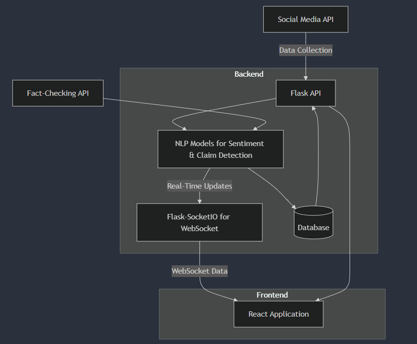
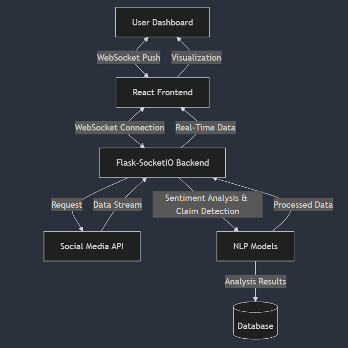
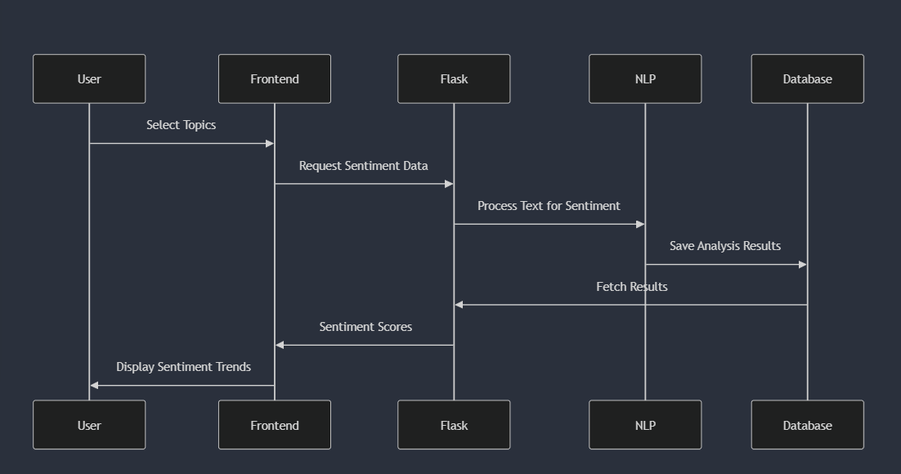

# Real-Time Social Media Sentiment Dashboard with Fact-Checking

## Project Overview

The **Real-Time Social Media Sentiment Dashboard with Fact-Checking** is a powerful SaaS platform for tracking public sentiment and verifying claims on social media in real time. The platform is designed for media agencies, brands, and researchers, providing insights into public opinion and tools for quick responses to misinformation.

## Key Features

### 1. Real-Time Sentiment Analysis
Monitors and visualizes public sentiment for any topic of interest on social media.

### 2. Claim Detection and Fact-Checking
Detects trending claims and verifies them with fact-checking APIs, alerting users to potential misinformation.

### 3. Dynamic Dashboard with Live Alerts
Displays real-time updates with custom alerts for topics and keywords, keeping users informed of critical changes.

---

## Architecture Overview

The architecture consists of a **Python (Flask) backend** for data processing and NLP tasks, and a **React frontend** for a responsive, real-time dashboard interface.

### Architecture Diagram
  
*Figure 1: Architecture Overview of the Real-Time Sentiment Dashboard with Flask-React Integration*

**Components:**
- **Frontend (React)**: Renders live data visualizations and handles user interactions.
- **Backend (Flask)**: Manages sentiment analysis, claim detection, and real-time data streaming.
- **Database**: Stores user data, sentiment logs, and verified claim history.
- **APIs**: Social media API for data, fact-checking API for claim verification.

---

## Data Flow

### Data Flow Diagram
  
*Figure 2: Data Flow from Social Media Data Collection to Real-Time User Dashboard*

**Steps:**
1. **Data Collection**: Social media data (e.g., Twitter) is fetched and stored in the database.
2. **Sentiment Analysis & Claim Detection**: NLP models analyze the data to assess sentiment and detect any trending claims.
3. **Real-Time Data Push**: Processed results are streamed to the frontend using WebSocket connections for live dashboard updates.
4. **Dashboard Display**: The React frontend visualizes real-time data, showing sentiment trends and misinformation alerts.

---

## Key Technologies

### Tech Stack Chart
| Component          | Technology                | Description |
|--------------------|---------------------------|-------------|
| **Backend**        | Flask                     | Lightweight, scalable backend framework for RESTful API |
|                    | Flask-SocketIO            | WebSocket support for real-time data streaming |
| **NLP**            | TextBlob, NLTK, Transformers | Sentiment analysis and claim detection using NLP models |
| **Frontend**       | React, Axios, socket.io-client | React for dynamic UI, Axios for HTTP requests, socket.io-client for real-time data |
| **Database**       | PostgreSQL / MongoDB      | Stores user data and claim logs for future reference |
| **Visualization**  | D3.js / Chart.js          | Visualizes sentiment trends and alert statuses in an engaging format |

---

## Feature Walkthrough

### Sentiment Analysis Workflow
1. **Data Processing**: Collected posts are analyzed for sentiment polarity using TextBlob and NLTK.
2. **Real-Time Update**: Sentiment scores are pushed to the frontend for live display.

  
*Figure 3: Sentiment Analysis Processing and Streaming Flow*

### Claim Verification Flow
1. **Claim Detection**: Claims are detected using Named Entity Recognition (NER) from the NLP models.
2. **Fact-Checking**: Claims are verified with Google’s Fact Check API, and results are sent to the dashboard.

  
*Figure 4: Claim Detection and Verification Process*

---

## Real-Time Dashboard

The **React dashboard** displays real-time insights, allowing users to track sentiment trends and flag misinformation.

### Sample Dashboard Visualization
  
*Figure 5: Example of Real-Time Sentiment and Claim Verification Dashboard*

Features:
- **Sentiment Over Time**: Graph displaying sentiment changes over time for selected topics.
- **Misinformation Alerts**: Pop-up alerts and severity levels for potential misinformation.
- **Customizable Topics**: Users can select specific topics and set up notifications.

---

## Why This Tech Stack?

- **Efficient and Scalable**: Flask and React are lightweight, allowing the platform to scale efficiently while handling real-time data.
- **Real-Time Data Streaming**: Flask-SocketIO and socket.io-client provide a reliable WebSocket connection for live updates.
- **Powerful NLP Tools**: Using Python’s NLP libraries, including TextBlob, NLTK, and Hugging Face Transformers, ensures accurate sentiment analysis and claim detection.
- **Data Visualization**: D3.js and Chart.js enable an engaging and informative visualization of data, giving users clear insights at a glance.

---

## Final Thoughts

This Real-Time Social Media Sentiment Dashboard with Fact-Checking is a comprehensive tool for tracking and responding to public opinion. With a robust backend, interactive frontend, and advanced NLP capabilities, this platform offers organizations an invaluable way to stay connected to online sentiment while combating misinformation.